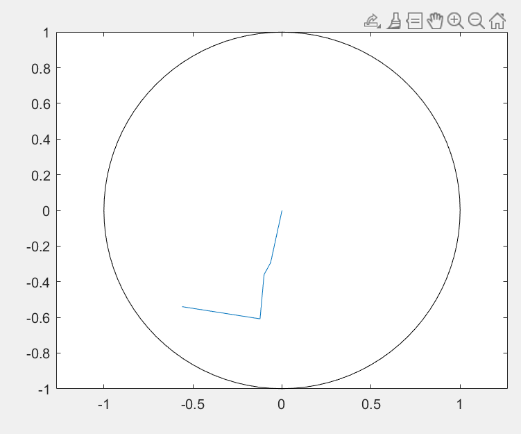
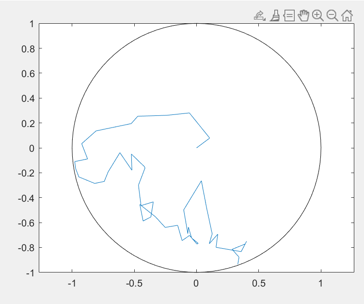
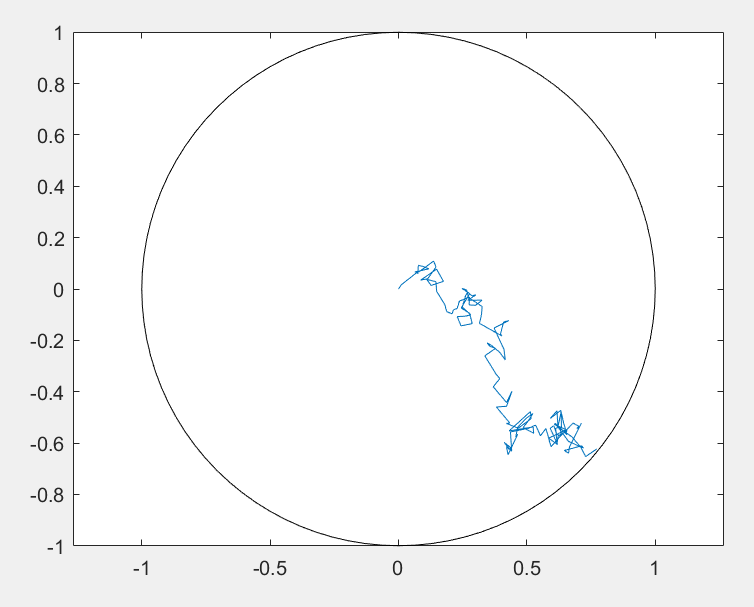

# Exit-Time Boundary Value Problem via SDE Simulation

This repository contains a MATLAB implementation for numerically solving an exit-time boundary value problem via stochastic differential equation (SDE) simulation.

## Project Overview

We consider the boundary value problem

```math
b(x,y)\cdot \nabla u(x,y) + \frac{1}{2}\Delta u(x,y) = f(x,y), 
\qquad (x,y)\in B_1(0),
```

with boundary condition

```math
u(x,y)=\frac{1}{2}, 
\qquad (x,y)\in \partial B_1(0),
```

where

```math
b(x,y)=(x,y), 
\qquad 
f(x,y)=x^2+y^2+1.
```

The exact solution is

```math
u(x,y)=\frac{x^2+y^2}{2}.
```

The goal of this project is to approximate the solution using the probabilistic representation of the PDE, simulate the corresponding diffusion process with the Euler--Maruyama method, and study the convergence behavior of the numerical error.

## Method

The associated stochastic differential equation is

```math
dX_t = X_t\,dt + dW_t,
```

where $W_t$ is a two-dimensional standard Brownian motion. Let

```math
\tau_D = \inf\{t \ge 0 : X_t \notin B_1(0)\}
```

denote the first exit time from the unit disk.

Using the Feynman--Kac representation, the solution can be written as

```math
u(x)=\mathbb{E}_x\left[\frac{1}{2}-\int_0^{\tau_D} f(X_s)\,ds\right].
```

In this repository, the expectation is approximated by Monte Carlo simulation, and the diffusion process is discretized by the Euler--Maruyama scheme.

## Repository Structure

- `main.m` — MATLAB code for Monte Carlo simulation, trajectory plotting, and error analysis
- `report.pdf` — final project report
- `fig2.png`, `fig3.png`, `fig4.png` — representative simulated trajectory plots
- `README.md` — project description

## How to Run

Open MATLAB in the project folder and run

```matlab
main
```

The program will:

- simulate sample trajectories of the diffusion process,
- estimate the numerical solution for different time step sizes,
- plot representative trajectories,
- generate a log-log error plot.

## Numerical Experiment

The code tests the following time step sizes:

```math
h \in \{0.1,\;0.03,\;0.01,\;0.003,\;0.001\}.
```

The Monte Carlo sample size is set to

```math
N=10000.
```

For each time step, the code computes the approximation error at the initial point $x_0=(0,0)$:

```math
\mathrm{err}_h = |\hat u_h(x_0)-u(x_0)|.
```

A log-log plot of the error versus the time step size is then used to study the temporal convergence order.

## Sample Trajectories

Representative sample trajectories for several time step sizes are shown below.

### Trajectory for $h=0.1$



### Trajectory for $h=0.01$



### Trajectory for $h=0.001$



## Notes

This project was completed as part of a numerical methods coursework assignment. The implementation is intended for educational and demonstration purposes.

## Author

Yuhan Ye
